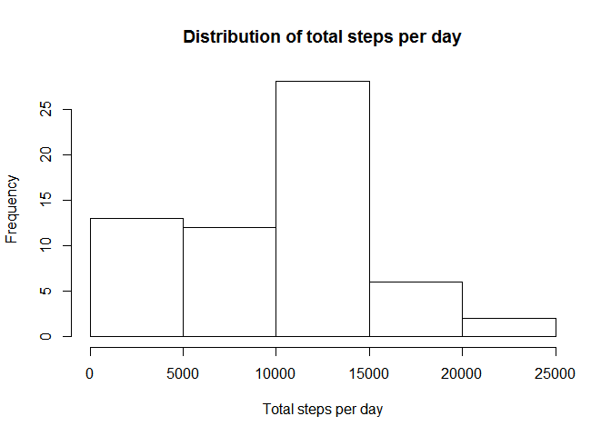
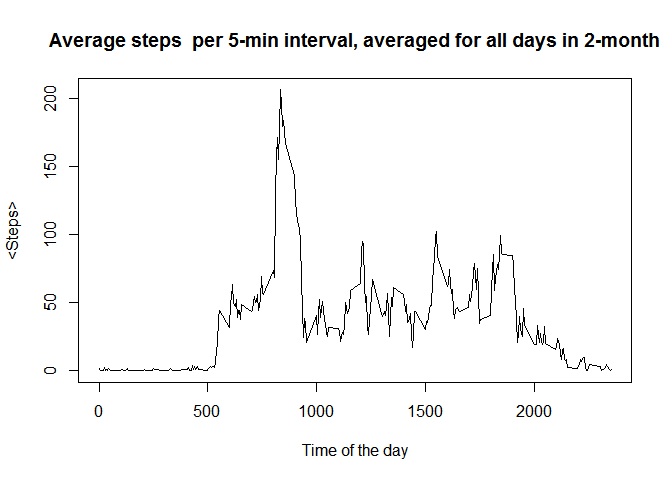
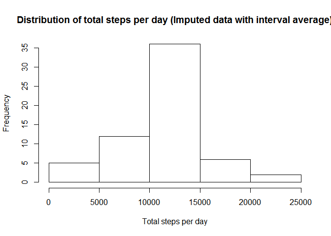
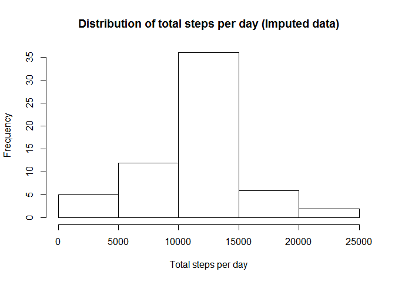
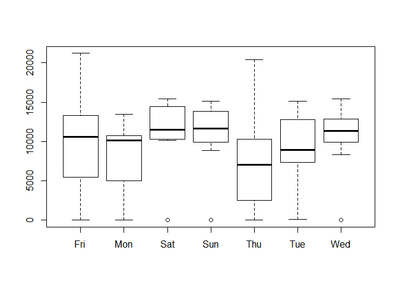
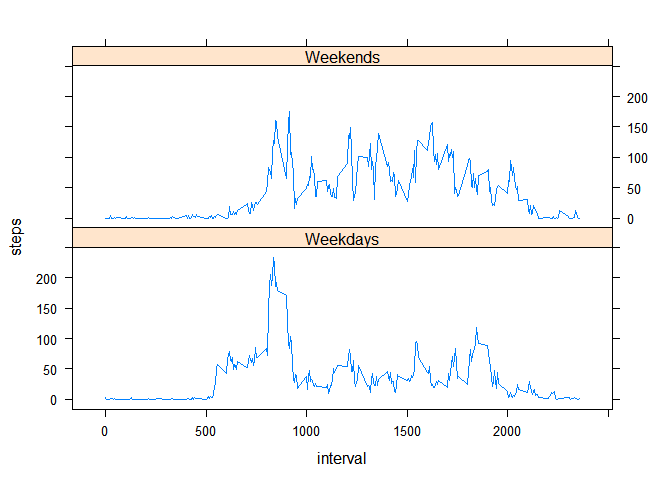
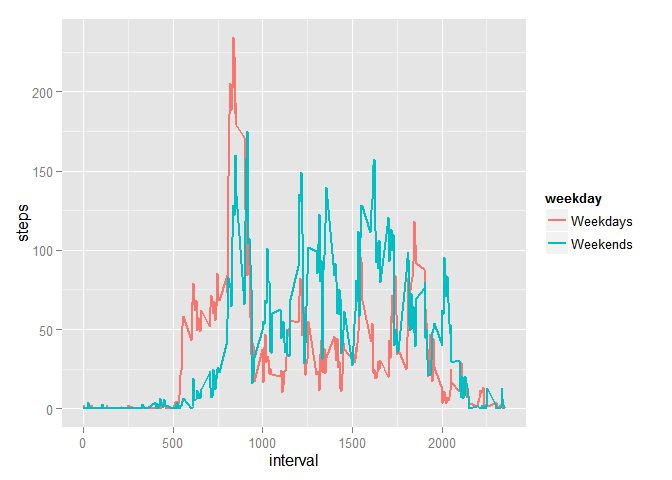

# Reproducible Research: Assignment 1
qpxu007  
Aug-6-2015  

## Summary

In this excercise, we will perform exploratory data analysis of pedometer data collected for a person  during a period of two months. Each data point corresponds to the number of steps taken every five minute interval. The analysis code and results are shown in Rmarkdown, which can then be converted to html and pdf for distribution. 

## Loading and preprocessing the data

We first load the data into a dataframe (df) and change the date column to the type Date. The *str* function provides a brief summary of the resulting data.


```r
df <- read.csv("activity.csv",na.strings = "NA", sep=',')
df$date <- as.Date(df$date)
str(df)
```

```
## 'data.frame':	17568 obs. of  3 variables:
##  $ steps   : int  NA NA NA NA NA NA NA NA NA NA ...
##  $ date    : Date, format: "2012-10-01" "2012-10-01" ...
##  $ interval: int  0 5 10 15 20 25 30 35 40 45 ...
```

## What is mean total number of steps taken per day?

We *aggregate* the number of steps in df (with sum) by day (i.e. for each day, we sum up the steps). The column names of the resulting dataframe stepsbyday are reassigned. We can then make a histogram of the total number of steps taken each day, which shows a distribution of steps per day.  


```r
stepsbyday <- aggregate(df$steps, by=list(df$date), FUN=sum, na.rm=TRUE)
colnames(stepsbyday)<-c("date","steps")
hist(stepsbyday$steps, xlab="Total steps per day", 
     main="Distribution of total steps per day")
```

 

We can calculate the mean and median of "total number of steps taken per day" using the *summary* function on the steps column of the stepsbyday dataframe.


```r
summary(stepsbyday$steps,na.rm = T)
```

```
##    Min. 1st Qu.  Median    Mean 3rd Qu.    Max. 
##       0    6778   10400    9354   12810   21190
```

## What is the average daily activity pattern?

To make a time series plot (i.e. type = "l") of the 5-minute interval (x-axis) and the average number of steps taken, averaged across all days (y-axis). We can aggreate df (with mean) by interval:


```r
meanperinterval <- aggregate(df$steps, by=list(df$interval), FUN=mean, na.rm=TRUE)
colnames(meanperinterval)<-c("interval","steps")
plot(meanperinterval$steps~meanperinterval$interval, type='l', 
     xlab="Time of the day", ylab="<Steps>", 
     main="Average steps  per 5-min interval, averaged for all days in 2-month")
```

 

We can get the maximum average steps per 5-minute interval, on average across all the days in the dataset, from the plot above. To get the exact number (835), so most activity occured in the morning (8:35am)


```r
i<-which(meanperinterval$steps==max(meanperinterval$steps))
meanperinterval[i,]$interval
```

```
## [1] 835
```

## Imputing missing values

To check for total number of rows with NA's, we can use the *summary* function again, or use is *is.na* function.  


```r
summary(df)
```

```
##      steps             date               interval     
##  Min.   :  0.00   Min.   :2012-10-01   Min.   :   0.0  
##  1st Qu.:  0.00   1st Qu.:2012-10-16   1st Qu.: 588.8  
##  Median :  0.00   Median :2012-10-31   Median :1177.5  
##  Mean   : 37.38   Mean   :2012-10-31   Mean   :1177.5  
##  3rd Qu.: 12.00   3rd Qu.:2012-11-15   3rd Qu.:1766.2  
##  Max.   :806.00   Max.   :2012-11-30   Max.   :2355.0  
##  NA's   :2304
```

```r
sum(is.na(df))
```

```
## [1] 2304
```

In our analysis above, we ignored NA values. We could try to fill in the missing values, for example, by using the average of the corresponding interval average:


```r
dfi<-merge(df, meanperinterval, by.x="interval", by.y="interval")
dfi$steps_imputed  <- ifelse(is.na(dfi$steps.x), dfi$steps.y, dfi$steps.x)
stepsbyday_i1 <- aggregate(dfi$steps_imputed, by=list(dfi$date), FUN=sum)
colnames(stepsbyday_i1)<-c("date","steps_imputed")
hist(stepsbyday_i1$steps_imputed, xlab="Total steps per day", 
     main="Distribution of total steps per day (Imputed data with interval average)")
```

 

```r
summary(stepsbyday_i1$steps_imputed)
```

```
##    Min. 1st Qu.  Median    Mean 3rd Qu.    Max. 
##      41    9819   10770   10770   12810   21190
```

We can see little change in median, but the mean is increased by about 15%.

We can also try a more sophisticated algorithm, such as the bootstrap expectation-maximization algorithm implemented in the package Amelia (we will use m=1 for convenience here).


```r
require(Amelia)
```

```
## Loading required package: Amelia
## Loading required package: Rcpp
## ## 
## ## Amelia II: Multiple Imputation
## ## (Version 1.7.3, built: 2014-11-14)
## ## Copyright (C) 2005-2015 James Honaker, Gary King and Matthew Blackwell
## ## Refer to http://gking.harvard.edu/amelia/ for more information
## ##
```

```r
df_imputed <- amelia(df, m=1)$imputations$imp1
```

```
## -- Imputation 1 --
## 
##   1  2
```

Now we can plot the histogram for steps per day, and compare it to that of the original:


```r
stepsbyday_i <- aggregate(df_imputed$steps, by=list(df_imputed$date), FUN=sum)
colnames(stepsbyday_i)<-c("date","steps")
hist(stepsbyday_i$steps, xlab="Total steps per day", 
     main="Distribution of total steps per day (Imputed data)")
```

 

```r
summary(stepsbyday_i$steps)
```

```
##    Min. 1st Qu.  Median    Mean 3rd Qu.    Max. 
##      41    9819   11160   10880   12880   21190
```

We can see that the histogram, mean, median look quite similar to those of the mean imputed data. 

## Are there differences in activity patterns between weekdays and weekends?

To answer this question, we can create a boxplot of the dataframe stepsbyday, aggregrated by weekday. 


```r
stepsbyday$weekday<- weekdays(stepsbyday$date, abbreviate = T)
boxplot(steps~weekday, data=stepsbyday)
```

 

As shown above, we see no significant difference in activity during weekends and weekdays (at the day level). 

Alternatively,  we can plot time series for weekdays and weekends (see time series plot above), first we add a new column weekday, by first translating the date into Sun-Sat, then converting it to a two-factor variable (Weekends or Weekdays).


```r
df$weekday <- ifelse ( weekdays(df$date, abbreviate=T) %in% 
                         c("Sat", "Sun"), "Weekends", "Weekdays")
timeseries <- aggregate(df$steps, by=list(df$interval, df$weekday), 
                        FUN=mean, na.rm=T)
colnames(timeseries)<-c("interval","weekday","steps")
library(lattice)
xyplot(steps ~ interval | weekday, data = timeseries, layout = c(1,2), type='l')
```

 

To more clearly see the difference, we can superimpose the two lines:


```r
library(ggplot2)
ggplot(data=timeseries, aes(x=interval,y=steps))+geom_line(aes(colour=weekday), size=1)
```

 

